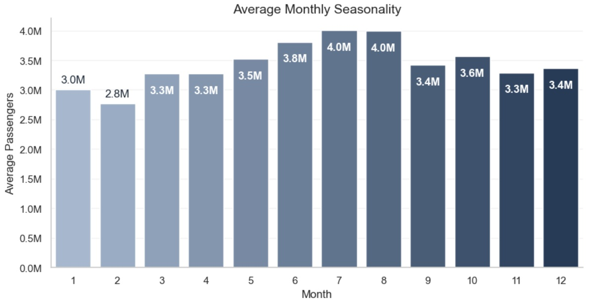
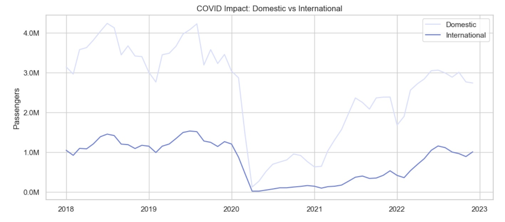
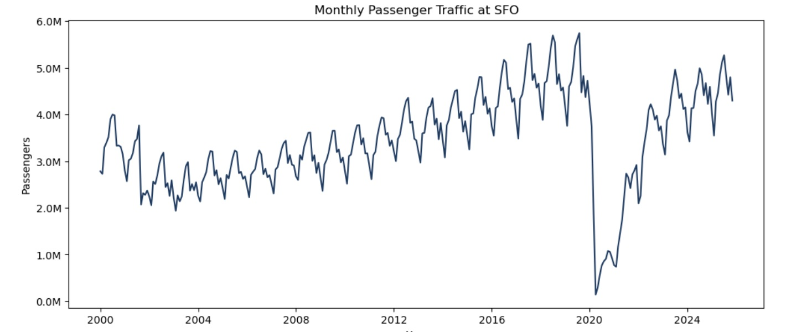
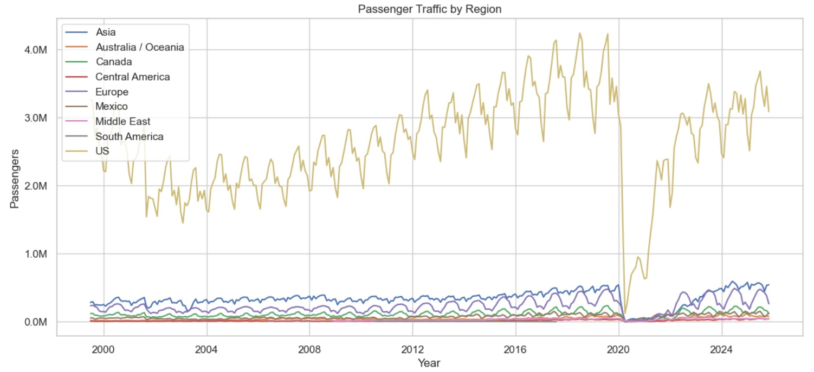
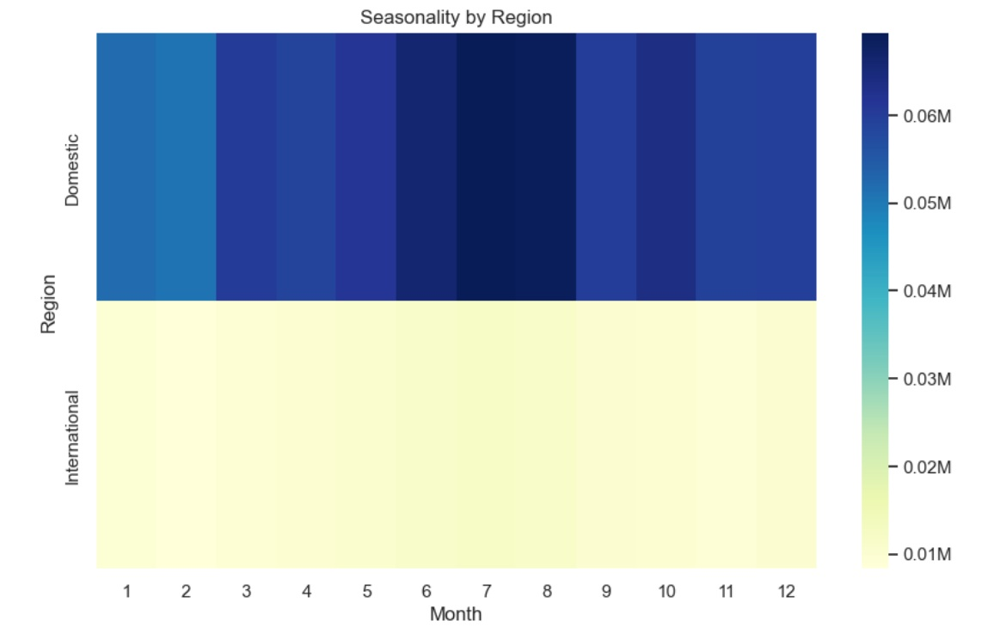
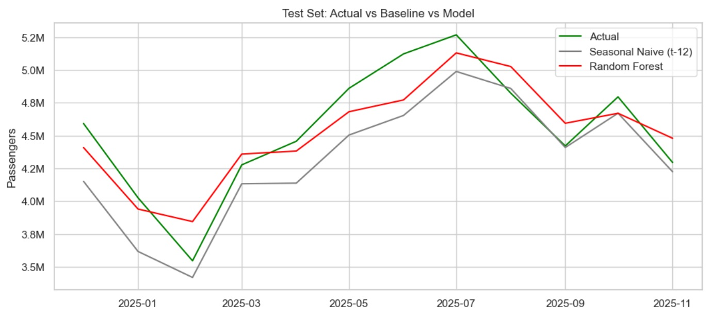
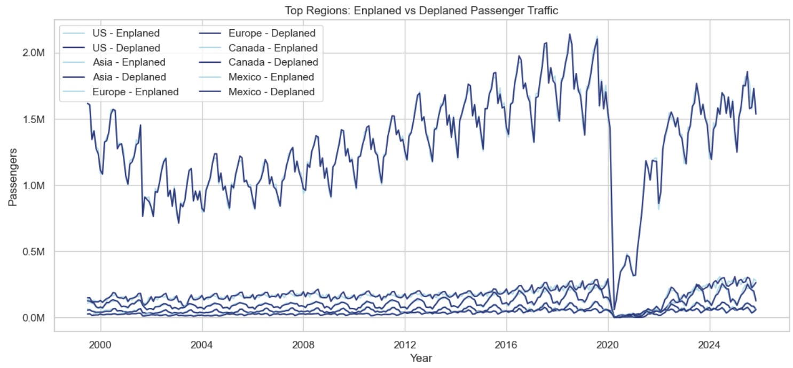

# ✈️ Air Traffic Passenger Analysis & Forecast (SFO)

📂 Dataset: Air_Traffic_Passenger_Statistics.csv

🔗 Source: https://catalog.data.gov/dataset/air-traffic-passenger-statistics
________________________________________

## 📌 Project Overview
This project analyses long-term passenger traffic at San Francisco International Airport (SFO) from 2000 to 2025, explores seasonal patterns and COVID-19 disruption, examines traffic composition by region, and builds a machine-learning model to forecast passenger volumes for 2026.
The analysis combines exploratory data analysis (EDA), time-series feature engineering, and Random Forest forecasting.
________________________________________

## Tools & Technologies

- 🐍 Python
- 📊 Pandas & NumPy
- 📈 Matplotlib & Seaborn
- 🤖 Scikit-learn (RandomForestRegressor)
- 📅 Time-series feature engineering
________________________________________

## Data Preparation & Processing

```Pandas
import pandas as pd
import numpy as np

df = pd.read_csv('Air_Traffic_Passenger_Statistics.csv')

# convert the date
df['Activity Period Start Date'] = pd.to_datetime(
    df['Activity Period Start Date'],
    errors='coerce'
)
```
# aggregate to the monthly level.
monthly = (df.groupby('Activity Period Start Date')['Passenger Count']
             .sum()
             .sort_index())
# We limit the period to 2000–2025
monthly = monthly['2000-01-01':'2025-11-01']
monthly.head()

### Data cleaning and transformation

- Converted date column to datetime
- Aggregated raw records to monthly totals
- Limited analysis period to 2000–2025
- Enforced monthly frequency (MS)
- Handled missing values and ensured continuity

```Python
monthly = (df.groupby('Activity Period Start Date')['Passenger Count']
             .sum()
             .sort_index())
monthly = monthly['2000-01-01':'2025-11-01']
monthly = monthly.asfreq('MS')
```
________________________________________

# Exploratory Analysis

## Overall Passenger Trends

- Strong long-term growth from 2000 to 2019
- Clear seasonal fluctuations
- Dramatic collapse during COVID-19 (2020)
- Gradual recovery after 2021
________________________________________

## 📅 Seasonality

Average monthly traffic shows strong summer peaks:
- 📉 Lowest: February
- 📈 Highest: July–August
- ✈️ Holiday effects visible in winter months
________________________________________

## 🦠 COVID-19 Impact

Passenger traffic dropped to near zero in early 2020:
- Domestic flights recovered faster
- International traffic remained depressed longer
- Recovery trajectory differed across regions
________________________________________

## 🌎 Regional Analysis

### Top Regions by Traffic
- 🇺🇸 US (dominant)
- Asia
- 🇪🇺 Europe
- 🇨🇦 Canada
- 🇲🇽 Mexico
### Key observations:
- US traffic overwhelmingly dominates total volume
- International regions show steady long-term growth
- COVID shock affected all regions simultaneously
________________________________________

## Traffic Composition

### Domestic vs International
- Domestic travel represents the majority of traffic
- International share declined sharply during COVID
- Gradual normalization after reopening
________________________________________

## 🌐 Regional Share Over Time

- US share remains consistently dominant
- Asia and Europe contribute the largest international portions
- Structural composition changed temporarily during the pandemic
________________________________________

## Seasonality by Region

Heatmap analysis shows:
- Strong summer peaks across regions
- Domestic traffic has higher amplitude
- International traffic exhibits smoother patterns
________________________________________

## 🤖 Machine Learning Forecast

### Feature Engineering
Time-series features were created:
- ⏮️ Lag features (lag_1, lag_12)
- 📊 Rolling means (3-month, 12-month)
- 📅 Calendar features (month, year)
________________________________________

## Model
Random Forest Regressor

```Python
RandomForestRegressor(
    n_estimators=200,
    random_state=42
)
```

## Model Evaluation

Compared against a Seasonal Naive baseline (t-12).
Metric	Seasonal Naive	Random Forest
MAE	232,601	173,243
RMSE	281,299	191,048
✅ Random Forest improved RMSE by ~32%
________________________________________

## Feature Importance

Most influential predictors:
1.	Rolling mean (3 months)
2.	Same month last year (lag_12)
3.	Previous month (lag_1)
4.	Calendar features (minor impact)
________________________________________

## Forecast for 2026

The model predicts:
•	Continued recovery after COVID disruption
•	Stable seasonal pattern
•	Peak traffic expected in summer months
•	No structural break detected
Forecast suggests passenger volumes approaching pre-pandemic highs.
________________________________________

## Key Insights

✔️ Air traffic exhibits strong seasonality
✔️ COVID-19 caused an unprecedented structural shock
✔️ Domestic travel recovered faster than international
✔️ US traffic dominates total volume
✔️ Random Forest effectively captures trend + seasonality
✔️ Short-term dependencies are critical for forecasting
________________________________________

## Conclusion

This project demonstrates how classical time-series techniques combined with machine learning can produce accurate operational forecasts and actionable insights for airport planning, resource allocation, and policy decisions.
________________________________________
## Key dashboards

Average Monthly Seasonality



COVID Impact by Region


COVID Impact on Passenger Traffic


COVID Impact. Domestic vs International



Feature Importance


Forecast for 2026


Model Performance on Test Set


Monthly Passenger Traffic at SFO



Passenger Traffic by Region



Regional Traffic Share Over Time


Seasonality by Region



Test Set: Actual vs Baseline vs Model



Top Regions by Passenger Traffic


Top Regions: Enplaned vs Deplaned Passenger Traffic



Traffic Share: Domestic vs International


